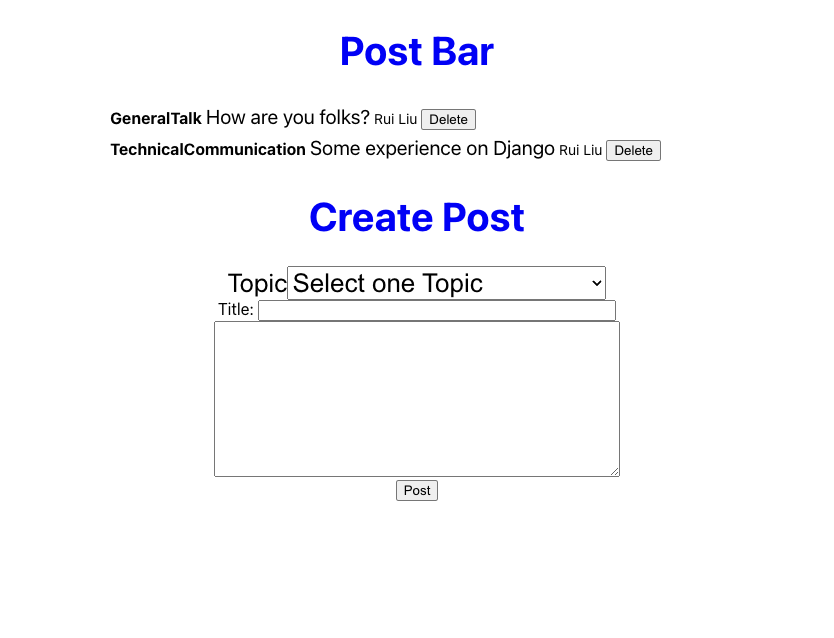
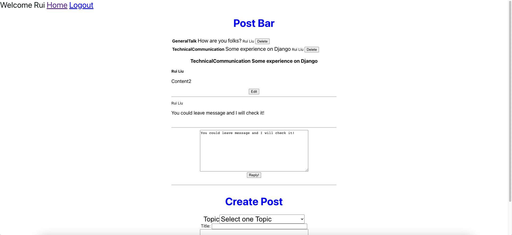

# Post-Bar
## Intro
 
**Post-Bar privide a environment for people working in programming to communicate, share information and talk freely.
 

 

## Technologies Used
MongoDB/Mongoose, Express, React, Node are used in this project.

## Getting Started  
To check out the app, <a href="https://postbar.herokuapp.com/" target="_blank">click here!</a>

## Next Steps
- Add redirect function and rerender functions.
- Be able to upload images.
- Better styling
- Be able to delete comments
